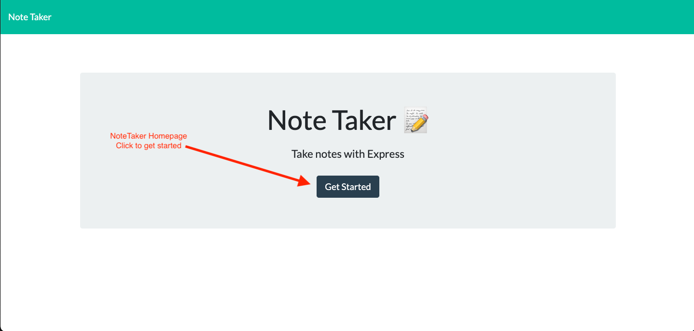
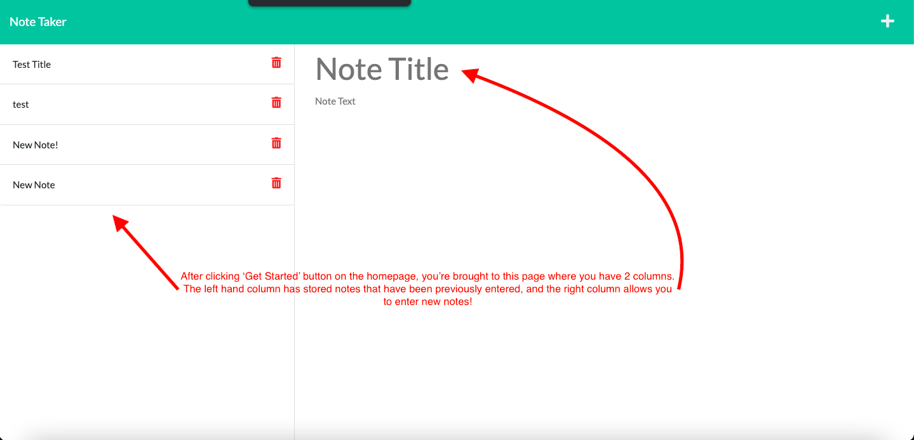
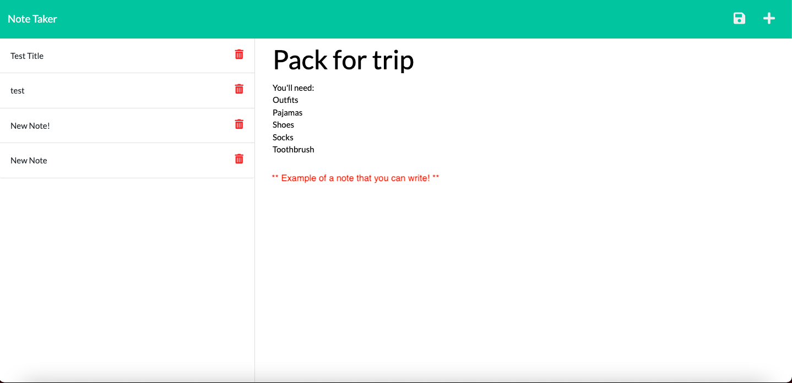

# note-taker

As a small business owner, I want to be able to write and save important notes so that I can keep track of tasks that I need to complete

## Table of Contents
- [Acceptance Criteria](#acceptance-criteria)
- [Technologies Used](#technologies-used)
* [Licenses](#licenses)
- [Demo](#demo)
- [Links](#links)
- [Questions](#questions)

## Acceptance Criteria
- GIVEN a note-taking application
- WHEN I open the Note Taker
- THEN I am presented with a landing page with a link to a notes page
- WHEN I click on the link to the notes page
- THEN I am presented with a page with existing notes listed in the left-hand column, plus empty fields to enter a new - note title and the note’s text in the right-hand column
- WHEN I enter a new note title and the note’s text
- THEN a Save icon appears in the navigation at the top of the page
- WHEN I click on the Save icon
- THEN the new note I have entered is saved and appears in the left-hand column with the other existing notes
- WHEN I click on an existing note in the list in the left-hand column
- THEN that note appears in the right-hand column
- WHEN I click on the Write icon in the navigation at the top of the page
- THEN I am presented with empty fields to enter a new note title and the note’s text in the right-hand column

## Technologies Used
- HTML
- CSS
- Javascript
- Express.js
- Node.js

## Licenses
This project is covered under MIT license.  Click on the license badge at the top of the README to learn more.

## Demo 

## Links
- GitHub Repo - https://github.com/mals1230/note-taker
- Deployed Application - https://safe-forest-16771.herokuapp.com/

## Questions 
Have questions about this project? Feel free to go to the project's repo and post an issue